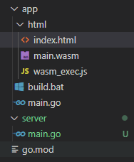

# 第二篇：使用 Gloang 和 Webassembly 构建一个聊天服务

- 外文地址：https://dev.to/taherfattahi/build-a-chat-service-using-golang-and-webassembly-part-2-1e4l
- 作者：[Taher Fattahi](https://dev.to/taherfattahi)

好的，现在我们要用golang编写第一个WebAssembly代码

下图是将达成的源代码结构:



作者源代码开源地址：https://github.com/taherfattahi/golangChatWebAssembly
本人实践的源码地址：

## Hello World

让我们先在Go中编写一个简单的hello world程序开始，再交叉编译为WebAssembly，并在浏览器上运行它。

1. 首先，你必须在你的设备上安装golang编译器 => [golang](https://go.dev/dl/)
2. 创建项目目录：
    ```shell
    $ mkdir golangChatWebAssembly 
    $ cd golangChatWebAssembly 
    ```
3. 初始化项目模块依赖:
    ```shell
    $ go mod init golangChatWebAssembly
    ```
4. 创建 `main.go` 文件
    ```shell
    $ mkdir app && cd app
    $ touch main.go
    ```
5.  编码 `main.go` 文件
    
    app/main.go
    ```golang
    package main

    import "fmt"

    func main() {
        fmt.Println("Go WebAssembly")
    }
    ```
6. 构建应用

    **下面的命令将把go应用程序编译到主文件中。Wasm(带有Wasm字节码)是一个web程序集的可执行模块。**

    `Linux` or `MacOS` 执行以下命令：
    ```shell
    $ GOOS=js GOARCH=wasm go build -o ./html/main.wasm .
    ```
    `Window` 系统建议先创建 `build.bat` 文件 然后再运行 `.bat`文件:
    ```shell
    $ touch build.bat
    ```
    在 `build.bat` 文件中写入以下语法:
    app/build.bat
    ```bat
    SET GOOS=js
    SET GOARCH=wasm

    go build -o ./html/main.wasm .

    SET GOOS=windows
    SET GOARCH=amd64
    ```
    然后在命令行中运行它: `.\build.bat`

7. Javascript 胶水语言

    正如我们已经讨论过的[第一篇](./part-1.md)，WebAssembly应该与JavaScript一起存在。因此，需要一些JavaScript粘合代码来导入我们刚刚创建的WebAssembly Module，并在浏览器中运行它。此代码在Go安装中已经可用。让我们继续并将其复制到 `html` 目录。
    ```shell
    $ cp "$(go env GOROOT)/misc/wasm/wasm_exec.js" ./html/
    ```
    上面的命令将包含运行WebAssembly的粘合代码的 `wasm_exec.js` 复制到 `html` 目录中。

8. 我们必须创建一个HTML页面，其中包含对Web Assembly的应用程序调用
    在 `app/html` 目录中创建 `index.html` 文件:
    
    app/html/index.html
    ```html
    <!DOCTYPE html>
    <html lang="en">

    <head>
        <meta charset="UTF-8">
        <meta http-equiv="X-UA-Compatible" content="IE=edge">
        <meta name="viewport" content="width=device-width, initial-scale=1.0">
        <title>Hello World - WebAssembly</title>
        <script src="wasm_exec.js"></script>
        <script>
            if (!WebAssembly.instantiateStreaming) {
                WebAssembly.instantiateStreaming = async (resp, importObject) => {
                    const source = await (await resp).arrayBuffer();
                    return await WebAssembly.instantiate(source, importObject);
                };
            }

            const go = new Go();
            WebAssembly.instantiateStreaming(fetch("main.wasm"), go.importObject).then(result => {
                go.run(result.instance);
            });
        </script>
    </head>

    </html>
    ```
9. 创建 Web 服务器
    在 Go 中创建一个简单的 Web 服务器
    ```
    cd ..
    mkdir server && cd server
    touch main.go
    ```
    `server.go` 文件中编写以下代码:
    server/main.go
    ```golang
    package main

    import (
        "log"
        "net/http"
    )

    const (
        AddSrv      = ":8080"
        TemplateDir = "../app/html"
    )

    func main() {
        fileSrv := http.FileServer(http.Dir(TemplateDir))

        err := http.ListenAndServe(AddSrv, fileSrv)

        if err != nil {
            log.Fatalln(err)
        }
    }
    ```
10. 启动服务器
    `server` 目录中运行
    ```shell
    $ go run main.go
    ```
    并在浏览器中打开该地址
    [http://127.0.0.1:8080](http://127.0.0.1:8080)
    并且在鼠标右键 > 检查 > DevTools > console 你能看到以下输出：
    
    $Go Web Assembly$
    